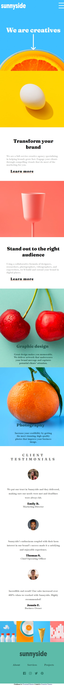

# Projeto de site de empresa de marketing

# Construido com HTML , CSS e JavaScript 

Este projeto é de um site não existente de uma compania de marketing ,utiliza primariamente html e css , o javascript é apenas usado para uma função simples .Para o site se adaptar a diferentes tamanhos de tela (celulares e tablets) é usado o @media e em certo ponto onde o tamanho da tela é bem menor que o de um computador as informações que ficarm em uma barra do topo se transforma em um hamburger e é preciso tocar (clicar) nele para criar uma aba com as informações(essa é a função com javascript) 

# Também é adaptado para mobile 

